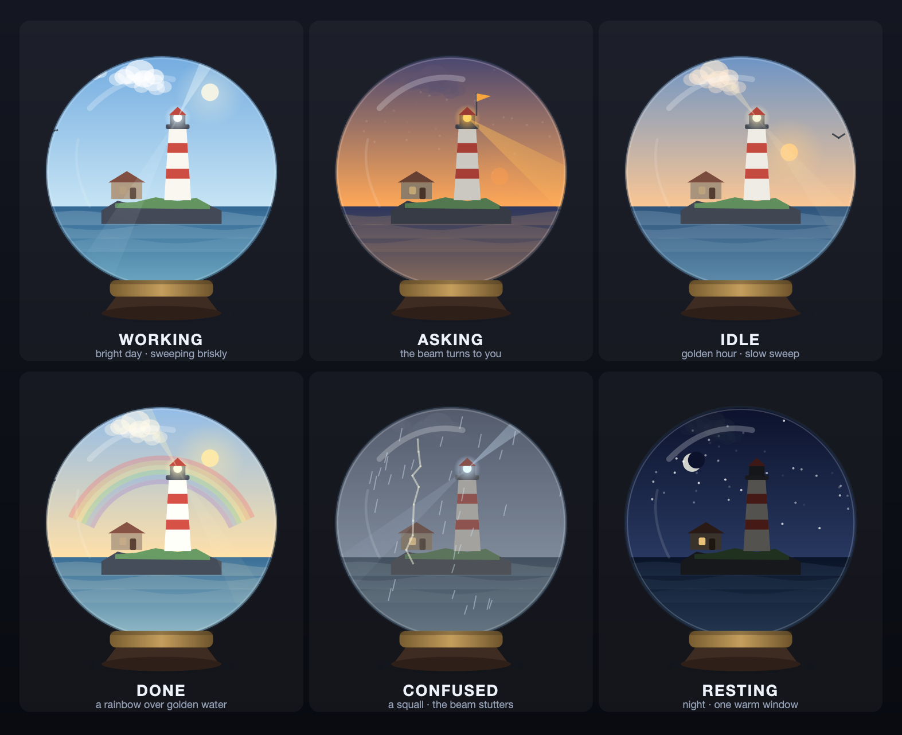
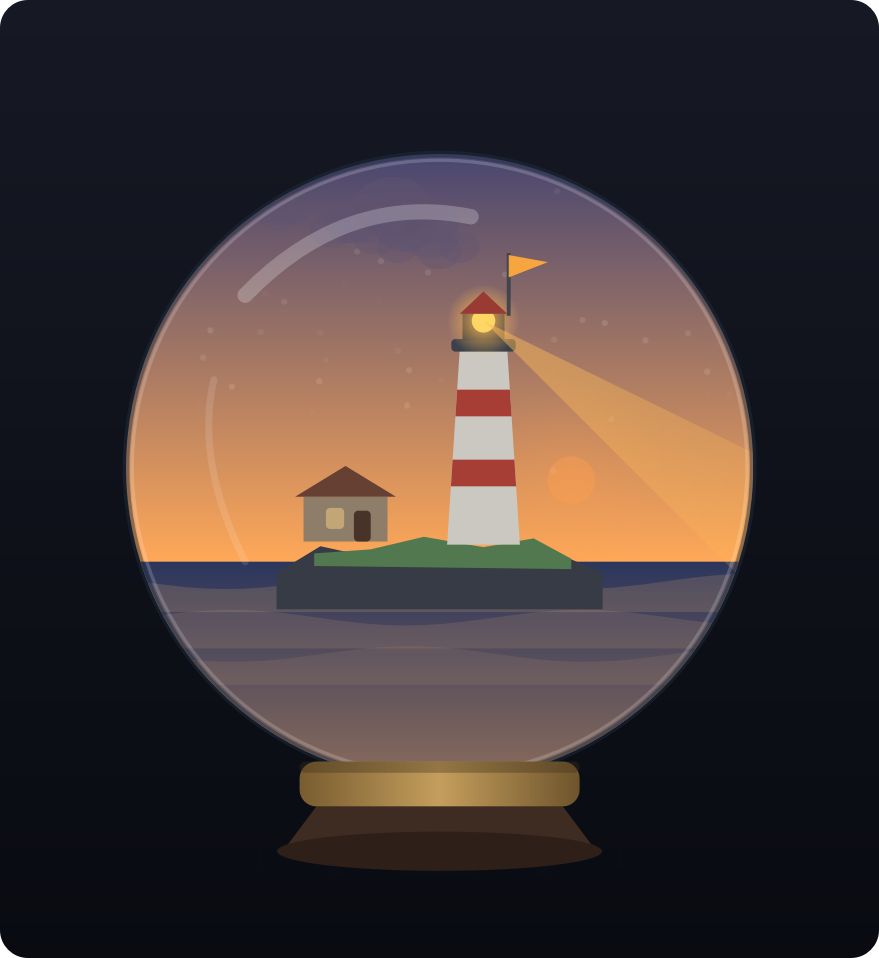

# BEACON — a tiny lighthouse for your AI

> When Claude needs you, the beacon turns to you.
> 它需要你时,光会转向你。

<p align="center">
  
</p>

A glass-domed lighthouse diorama that floats above all your windows (even
fullscreen apps) and mirrors your **Claude Code** state in real time. Not a
pet — **a tiny world whose weather is your agent's state**.

| Claude Code | In the dome |
|---|---|
| **working** | bright day — the lamp sweeps briskly, clouds hurry |
| **asking** | **amber dusk — the beam stops and points AT YOU, pulsing; a signal flag hoists; a ship's bell rings** |
| **idle** | golden hour — slow sweep, gulls drift through |
| **done** | a rainbow over golden water |
| **confused** | a squall — rain, lightning, the beam stutters |
| **resting** | night — lamp off, stars out, one warm window in the cottage |

### The moment that matters — *asking*

When Claude hits a question or a permission prompt, the dome falls to amber
dusk, the lamp lights, a signal flag hoists, a ship's bell rings once — and
the beam stops sweeping and **turns out of the glass toward you**. A
lighthouse doing the one thing lighthouses do.

<p align="center">
  
</p>

## Design

1. **The metaphor is the function.** A lighthouse exists to signal
   "you're needed here." The asking moment isn't an emote — it's the
   building doing the one thing lighthouses do.
2. **Transitions are weather.** The entire palette (sky/sea/light)
   crossfades over ~1.4s. Nothing swaps; dusk just falls.
3. **A diorama, not a creature.** Calm-tech: glanceable from the corner of
   your eye, zero neediness.
4. **Light-background safety by construction.** Every glow lands on the sky
   *inside* the dome. Nothing luminous ever touches your wallpaper, so it
   can't ring or plate light onto a white page.
5. **Reads your real agent state.** Watches `~/.ai-desktop-toy/sessions/*.json`,
   the session state your Claude Code hooks write, and aggregates across
   concurrent sessions: asking is sticky, a transcript-freshness guard kills
   false "asking", and priority runs asking > confused > working > done >
   idle > resting.

## Run

**Requires:** macOS · Python 3.9+ · PySide6 (`pip install PySide6`)

```bash
./run.sh            # or: python3 beacon.py
```

- **Drag** to move (position persists to `~/.beacon/window.json`)
- **Click** = knock on the glass: it wobbles, gulls scatter — and if Claude
  is asking, the click focuses the asking session's app
- **Menu-bar lighthouse icon** (the reliable controls — an accessory window
  never gets key focus on macOS): Show/Hide · **Tour mode** (auto-cycles all
  six states, 6s each — watch the whole story hands-free) · Live ·
  **Force state** submenu · Quit
- Keys (`1-6` force, `0` live, `T` tour, `ESC` hide) exist but only work in
  environments where the window can take focus

## Stopping it

```bash
pkill -f beacon.py
```

## Files

```
beacon.py   everything: state detection, sound synth, palettes, renderer,
            widget. Stdlib + PySide6 only.
run.sh      launcher
tools/      render_shots.py — regenerates the README images offscreen
assets/     the rendered state images
~/.beacon/  its own prefs + generated sounds (the only place it writes)
```

## If this were a real product (next)

- Per-session ships: each concurrent Claude Code session = a small boat in
  the water; the one that's asking sails to the front and signals.
- A foghorn easter egg on long-idle nights.
- Seasons: the dome's weather drifts with your local time of day.
